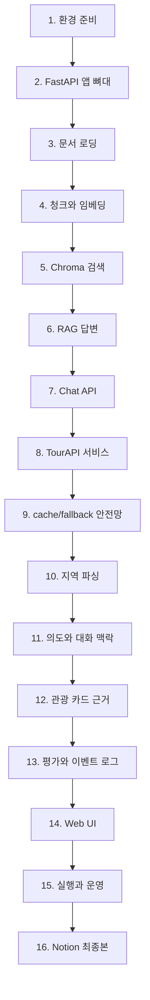

# RAG FastAPI 관광 챗봇 튜토리얼북

이 튜토리얼은 작은 예제 앱을 만드는 문서가 아니다. 원본 `chatbot_rag` 앱의 사용자 표면을 `project_template/`에 다시 만들면서 FastAPI, RAG, TourAPI, cache/fallback, 카드 근거, Web UI 검증까지 순서대로 익히는 초급자용 교재다.

완성하면 사용자는 `/tourism-ui/` 화면에서 “서울 강남구 휠체어 관광지 추천” 같은 질문을 입력하고, FastAPI `/tourism/chat`이 지역과 조건을 해석한 뒤 근거가 있는 관광 카드 5장을 내려주는 앱을 얻게 된다. 설명은 문서에만 있고, 실제 화면과 API 응답은 사용자용 관광 상담 앱으로 남긴다.

## 시작하기 전에

먼저 세 가지 원칙을 고정한다.

1. 원본형 표면을 만든다. 튜토리얼이라고 파일 구조나 화면을 축소하지 않는다.
2. 실행 산출물은 직접 만든다. `.env`, Chroma 런타임 DB, SQLite cache DB, 로그, `__pycache__`는 복사하지 않는다.
3. 외부 API가 없어도 학습이 끊기지 않게 한다. 원본 앱의 관광 markdown seed와 live markdown cache를 학습용 안전망으로 두고, live TourAPI는 준비된 뒤 연결한다.

## 전체 흐름



각 장은 같은 패턴으로 읽는다. 먼저 “이번 장에서 만들 것”을 보고, 파일을 만들거나 확인한 뒤, pytest 또는 노트북으로 검증한다. 막히면 같은 장의 “자주 나는 오류와 해결”을 먼저 본다.

## 1장. 환경 준비

목표는 같은 Python 환경에서 튜토리얼과 앱을 모두 실행하는 것이다.

읽을 문서:
- `docs/chapters/01_environment.md`

실행할 노트북:
- `notebooks/templates/01_environment_check.ipynb`

확인할 것:
- 루트 `.venv`가 있다.
- `project_template/.venv`는 루트 `.venv`를 가리키거나, 실행 스크립트가 루트 `.venv`를 사용한다.
- `python -m pytest`를 실행할 수 있다.

이 장을 지나면 “내 컴퓨터에서 FastAPI 앱을 띄울 준비”가 끝난다.

## 2장. FastAPI 앱 만들기

목표는 `project_template/app/main.py`에서 FastAPI 앱을 만들고 `/health`를 붙이는 것이다. 아직 RAG나 관광 추천을 붙이지 않는다. 먼저 서버가 살아 있는지 확인하는 가장 작은 표면을 만든다.

읽을 문서:
- `docs/chapters/02_fastapi.md`

실행할 노트북:
- `notebooks/templates/02_fastapi_health_check.ipynb`

성공 기준:
- `GET /health`가 `{"status": "ok"}`를 반환한다.
- `project_template` 안에서 서버가 실행된다.

## 3장. 문서 로딩

목표는 RAG에 넣을 원천 문서를 읽는 흐름을 만드는 것이다. 초급자는 여기서 “파일을 읽는다”와 “답변에 쓸 근거를 준비한다”의 차이를 배운다.

읽을 문서:
- `docs/chapters/03_document_loading.md`

실행할 노트북:
- `notebooks/templates/03_document_loading_check.ipynb`

성공 기준:
- 문서 경로가 설정에서 읽힌다.
- 비어 있는 문서나 없는 경로가 조용히 넘어가지 않는다.

## 4장. 청크와 임베딩

목표는 긴 문서를 검색 가능한 조각으로 나누고, 임베딩 서비스에 넣을 입력을 만든다. 여기서는 실제 LLM 답변보다 “검색 가능한 형태로 바꾸는 과정”이 중요하다.

읽을 문서:
- `docs/chapters/04_chunk_embedding.md`

실행할 노트북:
- `notebooks/templates/04_embedding_retrieval_check.ipynb`

성공 기준:
- 청크 크기와 overlap이 설정값으로 관리된다.
- 임베딩 입력이 빈 문자열이나 중복 조각으로 무너지지 않는다.

## 5장. Chroma 검색

목표는 저장된 청크를 검색해서 질문과 관련 있는 근거를 가져오는 것이다. 이 단계부터 RAG의 “검색”이 눈에 보인다.

읽을 문서:
- `docs/chapters/05_chroma_retrieval.md`

실행할 노트북:
- `notebooks/templates/04_embedding_retrieval_check.ipynb`

성공 기준:
- 검색 결과가 source, chunk id, distance 같은 근거 정보를 포함한다.
- Chroma 런타임 DB는 실행 중 생기는 파일로 보고 튜토리얼 산출물에는 넣지 않는다.

## 6장. RAG 답변 조립

목표는 검색 근거를 프롬프트에 넣고 답변을 만드는 흐름을 연결하는 것이다. 초급자는 여기서 “LLM이 그냥 아는 척 답하는 것”과 “검색 근거를 보고 답하는 것”을 구분한다.

읽을 문서:
- `docs/chapters/06_rag_answer.md`

실행할 노트북:
- `notebooks/templates/05_chat_api_check.ipynb`

성공 기준:
- 근거가 있으면 근거 기반 답변을 만든다.
- 근거가 없으면 확인 가능한 범위만 말한다.

## 7장. Chat API 연결

목표는 사용자의 질문을 HTTP 요청으로 받고 답변 JSON을 반환하는 것이다. 이 장부터 프론트엔드와 연결할 API 계약이 생긴다.

읽을 문서:
- `docs/chapters/07_chat_api.md`

실행할 노트북:
- `notebooks/templates/05_chat_api_check.ipynb`

성공 기준:
- 빈 메시지는 400으로 거절한다.
- 내부 구현 단어가 사용자 응답에 새지 않는다.

## 8장. TourAPI 서비스 붙이기

목표는 관광 후보를 가져올 서비스 계층을 만든다. API 키가 있으면 한국관광공사 TourAPI를 호출하고, 키가 없거나 네트워크가 불안하면 다음 장의 저장 자료 흐름으로 넘어갈 수 있게 만든다.

읽을 문서:
- `docs/chapters/08_tourapi.md`

실행할 노트북:
- `notebooks/templates/06_tourapi_cache_fallback_check.ipynb`

이 장에서 이해할 데이터:
- `data/processed/tour_area_codes.json`은 지역명과 시군구를 TourAPI 코드로 바꾸는 기준이다.
- API 키는 `.env`에만 둔다.
- live 조회는 학습의 마지막 보강이지, 초급자가 첫 실행을 성공시키기 위한 필수 조건이 아니다.

성공 기준:
- TourAPI 설정값이 `app/core/config.py`에서 읽힌다.
- 키가 없어도 앱 전체가 실패하지 않는다.

## 9장. Cache/Fallback 안전망 만들기

목표는 외부 API 없이도 관광 추천 흐름을 끝까지 볼 수 있게 하는 것이다. 여기서 원본 앱의 관광 markdown seed와 live markdown cache가 튜토리얼 본문 안으로 들어온다. 이것은 “나중에 업데이트할 데이터”가 아니라 초급자가 10-14장을 따라가기 위한 기본 재료다.

읽을 문서:
- `docs/chapters/09_cache_fallback.md`

실행할 노트북:
- `notebooks/templates/06_tourapi_cache_fallback_check.ipynb`

이 장에서 확인할 파일:
- `project_template/data/raw/tourism_accessible/`
- `project_template/data/generated/tour_api/live_markdown/`

조회 순서:
1. live markdown cache에서 지역 후보를 찾는다.
2. Chroma/RAG 색인에서 문서 근거를 찾는다.
3. raw tourism markdown seed에서 기본 후보를 찾는다.
4. 그래도 없고 live 조회가 가능하면 TourAPI를 시도한다.

성공 기준:
- `서울 강남구 휠체어 관광지 추천`이 API 키 없이도 카드 1장 이상을 반환한다.
- runtime SQLite cache DB는 커밋하지 않는다.
- 사용자는 “추천 카드 0개” 화면에서 멈추지 않는다.

## 10장. 지역 파싱

목표는 사용자가 입력한 “서울”, “강남구”, “부산 해운대구” 같은 말을 앱이 지역 코드로 해석하게 만드는 것이다.

읽을 문서:
- `docs/chapters/10_region_parsing.md`

실행할 노트북:
- `notebooks/templates/06_tourapi_cache_fallback_check.ipynb`

성공 기준:
- 전국 광역 지역 17개가 `/tourism/regions`에 나온다.
- 같은 이름의 `중구`처럼 여러 지역에 있는 시군구는 모호성 처리를 한다.
- `서울 강남구`처럼 부모 지역이 함께 있으면 하나로 확정한다.

## 11장. 의도와 대화 맥락

목표는 사용자가 “더 보기”, “조건 완화하기”, “같은 시도까지 넓히기”처럼 짧게 말해도 이전 질문 맥락을 이어받게 하는 것이다.

읽을 문서:
- `docs/chapters/11_intent_context.md`

실행할 노트북:
- `notebooks/templates/06_tourapi_cache_fallback_check.ipynb`

성공 기준:
- 관광 추천 질문과 지원하지 않는 질문을 구분한다.
- 후속 질문에서 이전 지역과 조건을 올바르게 이어받거나 버린다.

## 12장. 카드와 근거 만들기

목표는 답변 문자열만 반환하지 않고, 사용자가 비교할 수 있는 관광 카드와 출처를 함께 반환하는 것이다.

읽을 문서:
- `docs/chapters/12_card_evidence.md`

실행할 노트북:
- `notebooks/templates/06_tourapi_cache_fallback_check.ipynb`

성공 기준:
- 카드에는 제목, 주소, 이미지, 접근성 태그, 추천 이유, 출처가 들어간다.
- 공공데이터에 없는 편의정보는 추측하지 않는다.
- `lookup_mode` 같은 내부 구현 값은 사용자 화면 문구로 드러나지 않는다.

## 13장. 평가와 이벤트 로그

목표는 앱이 맞게 답했는지 반복 확인할 수 있게 평가 스크립트와 이벤트 로그를 둔다. 이 장은 운영자를 위한 장이지만, 초급자는 “테스트 데이터로 같은 질문을 다시 확인하는 법”을 배운다.

읽을 문서:
- `docs/chapters/13_eval_event.md`

실행할 노트북:
- `notebooks/templates/07_eval_report_check.ipynb`

성공 기준:
- 카드 수, 지역 일치, 필수 근거 단어를 평가한다.
- 이벤트 로그는 raw 사용자 메시지를 기본 저장하지 않는다.

## 14장. Web UI 확인

목표는 최종 사용자가 보는 `/tourism-ui/` 화면을 확인하는 것이다. 이 화면은 튜토리얼 설명 화면이 아니라 실제 무장애 관광 상담 화면이다.

읽을 문서:
- `docs/chapters/14_web_ui.md`

실행할 노트북:
- `notebooks/templates/08_web_ui_smoke_check.ipynb`

성공 기준:
- UI가 `/tourism/regions`와 `/tourism/chat`을 실제로 호출한다.
- 추천 카드 섹션이 0개가 아니라 실제 카드 수를 표시한다.
- 카드 이미지, 제목, 주소, 근거 태그가 보인다.

## 15장. 실행과 운영

목표는 로컬 서버, debug tunnel, release tunnel, 테스트 명령을 같은 규칙으로 실행하는 것이다.

읽을 문서:
- `docs/chapters/15_operations.md`

실행할 노트북:
- `notebooks/templates/01_environment_check.ipynb`
- `notebooks/templates/07_eval_report_check.ipynb`

대표 명령:

```bash
cd project_template
../.venv/bin/python -m uvicorn app.main:app --host 127.0.0.1 --port 8000
```

검증 명령:

```bash
python3 scripts/validate_tutorial_docs.py --check all
python3 scripts/validate_notion_tutorial_book.py
```

성공 출력:
- `original-map: ok`
- `tutorial-chapters: ok`
- `tutorial-book-structure: ok`
- `no-ui-tutorial-leak: ok`
- `notion-tutorial-book: ok`

## 16장. Notion 최종본 만들기

목표는 지금 읽고 있는 원고를 Notion 페이지에 순서형 교재로 옮기는 것이다. Notion에서는 변경 내역을 위에 쌓지 않는다. 초급자가 위에서 아래로 읽으며 1장부터 16장까지 따라갈 수 있어야 한다.

읽을 문서:
- `docs/chapters/16_notion.md`

최종 Notion에 유지할 것:
- 이 페이지의 순서형 장 구성
- 각 장의 문서 경로와 노트북 경로
- cache/fallback 데이터가 9장 학습 재료라는 설명
- 실제 UI와 API가 사용자용 표면이라는 원칙

최종 Notion에서 피할 것:
- “최종 판정”, “업데이트 내역”, “이번에 추가한 데이터” 같은 진행 보고서형 첫 화면
- 개인 PC 절대 경로
- API 키
- 실행 중 생기는 SQLite, Chroma, 로그 파일 경로를 복사하라는 지시

## 검증 노트북 목록

노트북은 `NewNote` 예제처럼 설명 셀과 코드 셀을 번갈아 두는 강의형 자료다. 각 노트북은 최소 11셀 이상, 마크다운 5셀 이상, 코드 6셀 이상을 가지며, 실제 템플릿은 18-20셀 규모다.

- `01_environment_check.ipynb`
- `02_fastapi_health_check.ipynb`
- `03_document_loading_check.ipynb`
- `04_embedding_retrieval_check.ipynb`
- `05_chat_api_check.ipynb`
- `06_tourapi_cache_fallback_check.ipynb`
- `07_eval_report_check.ipynb`
- `08_web_ui_smoke_check.ipynb`

## 막힐 때 보는 오류표

| 증상 | 먼저 볼 장 | 해결 방향 |
|---|---|---|
| `ModuleNotFoundError` | 1장 | 루트 `.venv`와 실행 Python을 확인한다. |
| `/health`가 안 열린다 | 2장 | FastAPI entrypoint와 포트를 확인한다. |
| 검색 결과가 비어 있다 | 3-5장 | 문서 로딩, 청크, Chroma 검색 순서로 다시 본다. |
| 관광 카드가 0개다 | 8-9장 | TourAPI 키보다 먼저 markdown seed/cache가 있는지 확인한다. |
| `강남구`를 못 알아듣는다 | 10장 | 전국 지역 코드와 모호성 처리를 확인한다. |
| “더 보기”가 이전 조건을 잃는다 | 11장 | session context 저장 흐름을 확인한다. |
| 카드에 근거가 없다 | 12장 | raw fields와 접근성 태그 생성 규칙을 확인한다. |
| 화면은 뜨는데 API를 안 탄다 | 14장 | 브라우저 네트워크에서 `/tourism/chat` POST를 확인한다. |
| Notion이 진행 보고서처럼 보인다 | 16장 | 변경 내역을 지우고 장별 본문 안에 녹인다. |

## 마지막 체크리스트

- [ ] 1장부터 16장까지 위에서 아래로 읽어도 흐름이 끊기지 않는다.
- [ ] 관광 markdown seed/cache 설명이 9장 본문 안에 들어 있다.
- [ ] 최종 Notion 첫 화면이 업데이트 로그가 아니라 튜토리얼 시작 화면이다.
- [ ] Web UI와 API 응답에는 튜토리얼 문구가 없다.
- [ ] `python3 scripts/validate_tutorial_docs.py --check all`이 통과한다.
- [ ] `python3 scripts/validate_notion_tutorial_book.py`가 통과한다.
