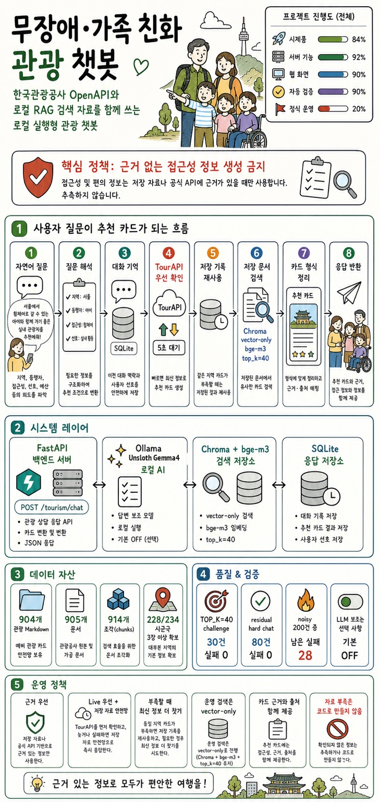
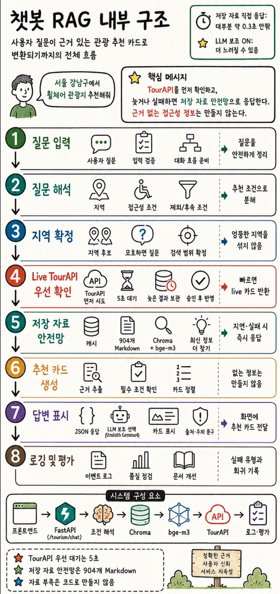

# 무장애·가족 친화 관광 챗봇

한국관광공사 OpenAPI와 로컬 RAG 검색 자료를 함께 사용해, 무장애·가족 친화 관광지를 상담하듯 추천하는 로컬 실행형 챗봇 프로젝트입니다.

현재 1차 시제품은 사용자의 자연어 질문에서 지역, 동행자 상황, 접근성 조건, 주변 지역 확장 의도를 먼저 파악한 뒤, 접근성·가족 친화 근거가 있는 관광지 카드를 반환합니다. `live_update` 모드에서는 TourAPI를 먼저 확인하고, 응답이 늦거나 실패하면 저장된 캐시와 Chroma/RAG fallback 안전망으로 바로 응답합니다. 웹 확인 UI는 이 repo에 있고, Flutter 전환 앱은 별도 repo `../chatbot_rag_app`와 GitHub `cheng80/chatbot_rag_app`에서 관리합니다.

일반 관광 추천도 기반 데이터상 가능하지만, 현재 검증 범위는 **무장애·가족 친화 조건을 중심으로 한 근거 있는 관광 추천**에 둡니다.



포스터의 기준이 되는 HTML 원본은 [README 프로젝트 인포그래픽](docs/project/readme_project_infographic.html)에서 확인할 수 있습니다. 같은 내용을 PNG로 렌더링한 [README 요약 이미지](docs/project/readme_project_infographic_ai_live_update_v1.png)도 함께 보관합니다.

챗봇 RAG 내부 구조를 더 자세히 푼 그림은 아래 인포그래픽과 [편집용 HTML](docs/project/chatbot_rag_internal_process_infographic.html), [PNG 이미지](docs/project/chatbot_rag_internal_process_infographic.png)에서 확인할 수 있습니다.



교수님 또는 외부 검토자에게는 먼저 [무장애·가족 친화 관광 챗봇 시제품 검토 자료](docs/project/professor_review_brief.md)를 보여주는 것을 권장합니다. 이 README는 설치와 실행 방법을 함께 담은 개발·운영 안내 문서입니다.

## 1. 서비스 개요

이 README는 실행 방법을 중심으로 쓰되, 딥러닝·머신러닝·분석 검토에 필요한 핵심 용어는 그대로 사용합니다.

| 용어 | 의미 |
|---|---|
| RAG | 검색된 문서나 관광 카드를 근거로 답변을 생성하는 구조 |
| LLM | 로컬에서 실행하는 언어 모델. 후보 카드 생성 뒤 상담 문장과 순서 보조에 사용 |
| 임베딩 | 질문과 문서를 벡터로 바꿔 유사도를 계산하는 표현 |
| ChromaDB | 임베딩된 문서와 관광 Markdown을 저장·검색하는 벡터DB |
| TourAPI | 한국관광공사 OpenAPI를 이 프로젝트에서 부르는 이름 |
| 캐시 | 이미 조회한 관광 카드를 저장해 반복 API 호출을 줄이는 장치 |
| 폴백 | OpenAPI 실패나 결과 부족 시 미리 수집한 자료로 응답을 유지하는 안전망 |
| eval | 정해진 질문셋으로 품질과 실패 여부를 반복 평가하는 절차 |

일반 RAG 문서 검색 챗봇은 다음 구조로 동작합니다.

```text
사용자 질문
  ↓
로컬 임베딩 모델로 질문을 검색용 숫자 표현으로 변환
  ↓
ChromaDB 벡터DB에서 관련 문서 검색
  ↓
검색 결과를 프롬프트에 삽입
  ↓
로컬 LLM으로 답변 생성
  ↓
답변 + 출처 반환
```

관광 챗봇은 `TOURISM_LOOKUP_STRATEGY` 설정에 따라 후보 조회 순서를 바꿀 수 있습니다. `live_update` 모드에서는 지역과 조건이 확정되면 한국관광공사 TourAPI를 먼저 조회하고, 응답이 늦거나 실패하면 저장된 live Markdown 캐시, ChromaDB/RAG 색인 자료, raw fallback Markdown으로 바로 응답합니다. `cache_first` 모드는 저장 자료를 먼저 쓰고 후보가 없거나 사용자가 최신 정보 보강을 요청할 때만 TourAPI를 조회합니다.

현재 시제품의 데이터 최신성은 live 조회와 원본 응답 SQLite 캐시로 제한적으로 보완하며, 장기적으로는 주기적 갱신 절차를 추가하는 방향입니다. 저장 자료만으로 반환한 후보가 5장보다 적을 때는 자동으로 live 조회를 더 늘리지 않고, 사용자가 누를 수 있는 `최신 정보 더 찾기` 후속 선택지를 제안합니다.

```text
사용자 질문
  ↓
지역/조건/확장 의도 구조화
  ↓
동명이 지역이면 지역 선택 후보 반환
  ↓
live_update 모드이면 TourAPI를 먼저 조회
  ↓
정해진 대기 시간 안에 live 결과가 오면 live 카드 반환
  ↓
늦거나 실패하면 live Markdown 캐시 확인
  ↓
ChromaDB/RAG로 미리 수집한 관광 자료 검색
  ↓
raw fallback Markdown 확인
  ↓
관광지 후보와 무장애 상세 정보 확인
  ↓
관광지 카드 형식으로 정리
  ↓
필요할 때만 LLM이 후보 순서와 상담 문장 보조
  ↓
답변 + 관광지 카드 + 출처 + 주의 문구 반환
```

검색 후보 단계는 기존 Chroma vector-only 구조를 유지합니다. 2026-05-27 한국어 BM25 토크나이저 재실험에서 실제 관광 corpus 1,010개와 QA 192개 기준 `bge-m3` vector-only top40이 BM25 후보보다 안정적이어서, 운영 기본 검색 폭만 `TOP_K=40`으로 넓혔습니다. AutoRAG는 retrieval-only 오프라인 실험 도구로만 두고 런타임에는 붙이지 않습니다.

2026-05-27 기준 자동 회귀·벤치마크와 2026-06-07 모델 변경 요약:

- TOP_K=40 challenge 30건: 실패 0
- TOP_K=40 residual hard chat 80건: 실패 0
- noisy realistic 200건 direct 실행: unsupported 답변 문구 수정 후 실패 28
- 통합 파이프라인 비교: `current_runtime` 168/200, `roberta_small_candidate` 174/200, `et5_roberta_combined` 172/200
- 2026-05-27 LLM reasoning assist가 실제 켜지는 20문항 eval: OFF, SuperGemma4, Gemma3, Gemma4 모두 20/20 통과
- 2026-06-07 기본 답변 모델: `hf.co/unsloth/gemma-4-E4B-it-qat-GGUF:UD-Q4_K_XL`
- 기본값은 reasoning assist OFF다. 남은 noisy 실패는 주로 수어/자막, 점자블록/촉지도, 보조견 같은 희소 접근성 카드/근거 부족이므로 코드가 근거를 만들어내는 방식으로 해결하지 않는다.

## 2. 폴더 구조

```text
chatbot_rag/
├─ app/
│  ├─ main.py
│  ├─ core/
│  ├─ api/
│  │  └─ routes/
│  ├─ schemas/
│  ├─ services/
│  ├─ repositories/
│  └─ utils/
├─ data/
│  ├─ raw/
│  ├─ processed/
│  └─ vector_store/
├─ docs/
│  ├─ project/
│  ├─ tourism/
│  ├─ rag/
│  ├─ design/
│  └─ etc/
├─ ingestion/
├─ prompts/
├─ scripts/
├─ tests/
├─ .env.example
├─ requirements.txt
└─ docker-compose.yml
```

문서별 위치는 [문서 인덱스](docs/README.md)를 먼저 확인한다.

## 3. 준비

다른 Mac에서 Anaconda/conda 설정을 걷어내고 Python 환경을 최소화해야 하면 [Mac Anaconda 제거 및 Python 환경 최소화 가이드](docs/etc/setup/remove_anaconda_mac_guide.md)를 먼저 참고한다.

### 프로젝트 진입

```bash
# 프로젝트 루트로 이동한 뒤 아래 명령을 실행한다.
```

### Python 가상환경

현재 Mac 환경은 Anaconda를 사용하지 않는다. 프로젝트에 `.venv`가 없으면 새로 만들고, 있으면 활성화만 한다.

Mac:

```bash
# 최초 1회: 이 프로젝트에서 사용할 pyenv Python 지정
pyenv local 3.12.10

# 최초 1회 또는 .venv를 다시 만들 때
python -m venv .venv

# 매번 프로젝트 작업을 시작할 때
source .venv/bin/activate
python -m pip install --upgrade pip
python -m pip install -r requirements.txt
```

pyenv `3.12.10`이 없으면 Homebrew 또는 시스템 Python으로 만들 수 있다.

```bash
python3 -m venv .venv
source .venv/bin/activate
python -m pip install --upgrade pip
python -m pip install -r requirements.txt
```

Windows PowerShell:

```powershell
python -m venv .venv
.\.venv\Scripts\Activate.ps1
python -m pip install --upgrade pip
python -m pip install -r requirements.txt
```

### 로컬 LLM 모델 준비

```bash
ollama run hf.co/unsloth/gemma-4-E4B-it-qat-GGUF:UD-Q4_K_XL
ollama run hf.co/mradermacher/supergemma4-e4b-abliterated-i1-GGUF:Q4_K_M
ollama pull gemma3:4b-it-q4_K_M
ollama pull gemma4:e4b
ollama pull qwen3:4b
ollama pull bge-m3
```

`unsloth/gemma-4-E4B-it-qat`는 현재 기본 LLM이고, `supergemma4-e4b-abliterated`와 `gemma3:4b-it-q4_K_M`는 비교 기준선입니다.
`gemma4:e4b`와 `qwen3:4b`는 별도 사고 과정을 반환하는 모델 후보로 비교했습니다. 사용자 제안 모델인 `huihui_ai/gemma-4-abliterated:e4b`는 실험 후보에 포함하되, 안전 필터 약화 경고가 있어 공개 테스트 기본값으로 쓰기 전 수동 검토가 필요합니다.
`bge-m3`가 로컬 환경에서 지원되지 않으면 `.env`의 `OLLAMA_EMBED_MODEL` 값을 다른 Ollama 임베딩 모델로 바꿔 사용할 수 있습니다.

AutoRAG는 운영 런타임 의존성이 아니라 retrieval-only 오프라인 검색 실험 도구입니다. 필요할 때만 별도 venv에 `requirements-autorag.txt`를 설치해 `docs/tourism/autorag_retrieval_experiment.md` 절차로 실행합니다.

## 4. 환경 변수

```bash
cp .env.example .env
```

공공데이터포털 인증키는 `.env`에만 넣고 커밋하지 않습니다. 공공데이터 호출을 줄이고 저장 자료만으로 확인하고 싶을 때는 `.env` 또는 실행 명령에서 `TOURISM_LIVE_LOOKUP_ENABLED=false`를 사용합니다.

주요 값:

```env
OLLAMA_BASE_URL=http://localhost:11434
OLLAMA_CHAT_MODEL=hf.co/unsloth/gemma-4-E4B-it-qat-GGUF:UD-Q4_K_XL
OLLAMA_EMBED_MODEL=bge-m3
CHROMA_PATH=./data/vector_store/chroma
CHROMA_COLLECTION=manual_documents
DATABASE_URL=sqlite:///./data/app.sqlite3
RAW_DATA_PATH=./data/raw
TOP_K=40
TOUR_API_SERVICE_KEY=
TOUR_API_ACCESSIBLE_SERVICE_KEY=
TOUR_API_RESPONSE_CACHE_ENABLED=true
TOUR_API_RESPONSE_CACHE_PATH=./data/generated/tour_api/live_response_cache.sqlite3
TOURISM_LIVE_LOOKUP_ENABLED=true
TOURISM_LOOKUP_STRATEGY=cache_first
TOURISM_LIVE_FIRST_WAIT_SECONDS=5
TOURISM_LIVE_BACKGROUND_TIMEOUT_SECONDS=15
TOURISM_LIVE_CACHE_PATH=./data/generated/tour_api/live_markdown
TOURISM_SAMPLE_PATH=./data/raw/tourism_accessible
TOURISM_QUERY_EVENT_LOG_ENABLED=true
TOURISM_QUERY_EVENT_LOG_INCLUDE_MESSAGE=false
```

`TOURISM_LOOKUP_STRATEGY=live_update`로 바꾸면 TourAPI를 먼저 시도합니다. `TOURISM_LIVE_FIRST_WAIT_SECONDS` 안에 결과가 오면 live 카드를 바로 반환하고, 늦거나 실패하면 캐시/RAG/fallback 결과를 먼저 보여줍니다. 백그라운드 live 결과가 `TOURISM_LIVE_BACKGROUND_TIMEOUT_SECONDS` 안에 도착하면 다음 요청에서 `최신 결과 업데이트 보기` 같은 승인 선택지로 반영할 수 있습니다.

## 5. 문서 넣기

`data/raw/` 아래에 문서를 넣습니다.

지원 형식:

```text
.pdf
.txt
.md
```

예:

```text
data/raw/product_manual.pdf
data/raw/faq.md
data/raw/install_guide.txt
```

## 6. 문서 색인

```bash
source .venv/bin/activate
python scripts/ingest_all.py
```

기존 Vector DB를 비우고 다시 색인하려면:

```bash
source .venv/bin/activate
python scripts/rebuild_index.py
```

임베딩 모델을 바꾼 뒤에는 기존 벡터와 차원이 달라질 수 있으므로 `python scripts/rebuild_index.py`로 다시 색인한다.

## 7. 서버 실행

서버류 실행 원칙:

- `uvicorn`, `cloudflared`, `python3 -m http.server` 같은 장시간 실행 프로세스는 Codex 백그라운드 세션으로 조용히 띄우지 않는다.
- 에디터의 새 터미널을 열고 사용자가 로그와 종료 상태를 볼 수 있게 실행한다.
- FastAPI 서버와 Cloudflare 터널은 서로 다른 터미널에서 실행한다.

```bash
source .venv/bin/activate
python -m uvicorn app.main:app --host 127.0.0.1 --port 8000 --reload
```

관광 챗봇 확인 화면:

```text
http://127.0.0.1:8000/tourism-ui/
```

개발자용 요청/응답 문서:

```text
http://127.0.0.1:8000/docs
```

ReDoc:

```text
http://127.0.0.1:8000/redoc
```

## 8. 질문 테스트

브라우저에서 `/tourism-ui/`를 열면 채팅 입력, 접어서 여는 지역·예시 선택, 추천 카드, 개발자용 요청/응답 문서 링크를 한 화면에서 확인할 수 있습니다.

관광 챗봇 API를 직접 확인하려면:

```bash
curl -X POST http://127.0.0.1:8000/tourism/chat \
  -H "Content-Type: application/json" \
  -d '{"message":"서울 강남구에서 휠체어 관광지 추천해줘"}'
```

동명이 시군구 확인:

```bash
curl -X POST http://127.0.0.1:8000/tourism/chat \
  -H "Content-Type: application/json" \
  -d '{"message":"중구에서 휠체어 관광지 추천해줘"}'
```

`중구`처럼 여러 시도에 있는 지명은 추천 카드 대신 지역 선택 후보를 반환합니다. `부산 중구에서 ...`처럼 광역 지역을 함께 말하면 해당 시군구로 확정합니다.

일반 문서 검색 챗봇을 확인하려면 아래 `curl`을 사용할 수 있습니다.

```bash
curl -X POST http://localhost:8000/chat \
  -H "Content-Type: application/json" \
  -d '{"message":"환불은 언제까지 가능한가요?"}'
```

응답 예:

```json
{
  "answer": "문서에 따르면 환불은 구매일로부터 7일 이내에 가능합니다.",
  "sources": [
    {
      "source": "example_faq.md",
      "page": null,
      "chunk_id": "...",
      "chunk_index": 0,
      "distance": 0.42
    }
  ]
}
```

## 9. 주요 요청 경로

| Method | Path | 설명 |
|---|---|---|
| GET | `/health` | 서버 상태 확인 |
| POST | `/chat` | 일반 문서 검색 질문 답변 |
| POST | `/tourism/chat` | 무장애 관광 상담 답변 + 관광지 카드 API |
| GET | `/tourism-ui/` | 관광 챗봇 웹 확인 화면 |
| POST | `/documents/reindex` | `data/raw/` 문서 재색인 |
| GET | `/documents/stats` | 검색 DB 상태 |

Flutter 앱은 같은 FastAPI 서버를 사용한다. 앱 repo에서 실행할 때는 백엔드 서버를 먼저 보이는 터미널에서 띄운 뒤 아래처럼 API 주소를 주입한다.

```bash
cd ../chatbot_rag_app
flutter test
flutter run --dart-define=API_BASE=http://127.0.0.1:8000
```

## 10. 관광 시제품 데이터와 정책

현재 예비 관광 자료는 `data/raw/tourism_accessible/` 기준 904개 Markdown으로 확보했습니다. Chroma에는 905개 문서 / 914개 청크가 색인되어 있고, TourAPI 지역 코드 234개 중 228개 시군구가 3장 이상 fallback 카드를 갖고 있습니다. 전체 관광지를 모두 저장한 데이터베이스가 아니라, 공공데이터 조회 장애나 호출량 제한 상황에서도 기본 응답이 무너지지 않도록 하는 최소 안전망입니다.

전체 진행도는 [무장애 관광 챗봇 진행도](docs/project/progress_overview.md)에서 확인한다.
예비 관광 자료 수집, 호출량, 전국 시군구 규모, 샘플 QA 기준은 [관광 데이터 운영 문서](docs/tourism/tourism_data_operations.md)에서 관리합니다.
응답 전략 변경 이력과 되돌림 기준은 [관광 챗봇 응답 전략 결정 기록](docs/tourism/tourism_response_strategy_decision.md)을 참고한다.

| 범위 | 현재 샘플 |
|---|---|
| 수도권/광역시 | 서울, 부산, 인천, 대전, 대구, 광주, 울산, 세종 |
| 도 단위 | 경기, 강원, 충북, 충남, 경북, 경남, 전북, 전남, 제주 |
| 별도 보강 지역 | 강릉, 서귀포시 |

주요 정책:

- `TOURISM_LOOKUP_STRATEGY=live_update`이면 지역이 확정된 질문에서 TourAPI를 먼저 시도한다.
- live 결과가 정해진 대기 시간 안에 오고 요청 조건 근거가 맞으면 `lookup_mode=live`로 반환한다.
- live 응답이 늦거나 실패하면 저장된 live Markdown 캐시, ChromaDB/RAG 색인 자료, raw fallback Markdown 순서로 응답을 유지한다.
- 백그라운드 live 결과가 제한 시간 안에 도착하면 다음 요청에서 사용자의 승인 후 `lookup_mode=live_update`로 반영한다.
- `TOURISM_LOOKUP_STRATEGY=cache_first`이면 저장 자료를 먼저 쓰고, 후보가 없거나 사용자가 `최신 정보 더 찾기`를 요청할 때 TourAPI를 조회한다.
- 저장 자료 응답이 5장보다 적어도 자동으로 live 조회를 추가 확장하지 않고 `최신 정보 더 찾기` 후속 선택지를 제안한다.
- 실시간 조회 결과는 원본 SQLite 캐시와 `data/generated/tour_api/live_markdown/`에 저장해 같은 지역 반복 호출을 줄인다.
- 모든 후보 경로가 실패하거나 조건 근거가 맞는 카드가 없으면 결과 부족 응답을 반환하고 주의 문구에 진단을 남긴다.
- 응답의 `lookup_mode`는 현재 응답이 live, live update, 캐시, RAG 검색 자료, 폴백 자료, 지역 선택 질문 중 어디에서 왔는지 나타낸다.
- 복합 상황 질문의 LLM 추론 보조는 기본값이 꺼져 있다. 품질 비교나 실험이 필요할 때만 `TOURISM_REASONING_ASSIST_ENABLED=true`로 켜고, 응답의 `reasoning_assist_used`와 `reasoning_assist_notes`로 사용 여부와 확인 필요 메모를 확인한다.
- 추론 보조는 후보 카드의 순서와 설명 방향만 조정한다. 후보에 없는 장소나 접근성 정보를 만들면 안 된다.
- 추론 보조를 끈 기본 모드에서 질문 의도 파악이 달라지는지 확인하려면 같은 eval을 ON/OFF로 실행해 `lookup_mode`, 카드 수, 카드 ID 순서, `warnings`, `suggested_messages`를 비교한다.
- `/tourism/chat` 응답은 `data/generated/tour_api/query_card_events.jsonl`에 이벤트로 남긴다. 기본값은 원문 질문을 저장하지 않고 `message_hash`만 저장한다.
- 원문 질문까지 저장해야 할 때만 `TOURISM_QUERY_EVENT_LOG_INCLUDE_MESSAGE=true`를 켠다.
- `TourAPIService`는 원본 TourAPI 응답을 `data/generated/tour_api/live_response_cache.sqlite3`에 저장해 서버 재시작 뒤 같은 지역/상세 조회를 재사용한다. 호출량이나 시연장 네트워크가 불안하면 `.env`에서 `TOURISM_LIVE_LOOKUP_ENABLED=false`로 끄고 폴백 자료만으로 운영한다.
- 장기 권장 구조는 live 조회, 저장 자료 안전망, 주기적 갱신의 조합이다. 데이터 최신성은 시제품 이후 갱신 절차로 보완한다.
- 시군구처럼 좁은 지역을 명시하면 자동으로 타 지역을 섞지 않는다.
- `근처`, `주변`, `가까운`, `인근`은 상위 광역 확장 신호로 쓰지 않고, 요청 시군구 후보를 먼저 반환한다.
- `부족하면 서울 전체로 넓혀줘`처럼 조건부 확장을 말한 경우에는 요청 시군구 후보가 기본 표시 수인 5장보다 부족할 때만 상위 지역 후보를 섞는다.
- `서울 전체로 넓혀줘`, `범위 넓혀줘`처럼 무조건 확장을 명확히 말한 경우에는 상위 지역 후보를 섞고 답변 문구에 확장 여부를 표시한다.
- `중구`, `남구`, `동구`, `서구`, `북구`처럼 여러 시도에 있는 지명은 먼저 지역 선택 후보를 반환한다.
- `아빠`, `어머니`, `부모님` 같은 관계 호칭만으로 나이를 추정하지 않는다.
- 공공데이터에 없는 편의정보는 추측하지 않고 `확인 필요`로 남긴다.
- 청원군, 마산시, 진해시, 남제주군, 북제주군처럼 TourAPI 지역 코드에 남아 있는 과거 지명은 현재 행정구역 기준으로 안내한다. 공식 무장애 상세 3장 미만 지역은 현재 계룡시 1장으로 관리한다.

## 11. 외부 임시 확인

Mac mini 등 로컬 머신에서 외부 확인이 필요하면 Cloudflare Quick Tunnel을 사용할 수 있습니다.

FastAPI와 Cloudflare는 같은 명령이 아니다. 터미널을 2개 열어 각각 실행한다.

최초 1회만 Cloudflare CLI를 설치한다.

```bash
brew install cloudflared
```

터미널 1: FastAPI 서버

```bash
.venv/bin/python -m uvicorn app.main:app --host 127.0.0.1 --port 8000
```

공공데이터 호출을 더 쓰지 않을 때는 RAG/폴백 전용 모드로 서버를 실행한다.

```bash
TOURISM_LIVE_LOOKUP_ENABLED=false .venv/bin/python -m uvicorn app.main:app --host 127.0.0.1 --port 8000 --reload
```

터미널 2: Cloudflare Quick Tunnel

```bash
cloudflared tunnel --url http://127.0.0.1:8000
```

출력된 `https://...trycloudflare.com` 주소 뒤에 `/tourism-ui/`를 붙여 접속한다.

```text
https://...trycloudflare.com/tourism-ui/
```

Quick Tunnel은 임시 확인용이다. 시연이 끝나면 `cloudflared`와 `uvicorn`을 종료한다.

## 12. 기준 기술 구성

| 역할 | 선택 |
|---|---|
| 로컬 LLM 실행 | Ollama + `hf.co/unsloth/gemma-4-E4B-it-qat-GGUF:UD-Q4_K_XL` |
| 비교 기준선 | `hf.co/mradermacher/supergemma4-e4b-abliterated-i1-GGUF:Q4_K_M`, `gemma3:4b-it-q4_K_M` |
| 임베딩 | bge-m3 |
| 벡터DB / RAG 검색 | ChromaDB vector-only, `TOP_K=40` |
| 일반 DB | SQLite |
| 외부 접속 | Cloudflare Quick Tunnel |
| 화면 확인 | `/tourism-ui/` 정적 웹 화면 |
| 요청 테스트 | Swagger/ReDoc, curl, pytest |
| 로그 분석 | `notebooks/tourism_event_log_analysis.ipynb` |
| 오프라인 검색 실험 | AutoRAG retrieval-only, 런타임 미사용 |

## 13. 개발 순서

1. `data/raw/`에 문서 추가
2. `source .venv/bin/activate`로 프로젝트 가상환경 진입
3. `python scripts/ingest_all.py` 실행
4. `python -m uvicorn app.main:app --reload` 실행
5. `/tourism-ui/`, Swagger, curl, pytest로 요청/응답 확인
6. 검색 품질이 낮으면 먼저 eval 실패 bucket과 카드 근거 부족을 확인하고, 임베딩 모델이나 `TOP_K`를 바꾸면 재색인한다.
7. 문서가 많아지면 재정렬, 복합 검색, 권한 필터링 추가

관광 샘플을 갱신할 때:

```bash
python scripts/fetch_tour_area_codes.py
python scripts/fetch_accessible_tourism_samples.py --preset mvp --rows 20 --max-api-calls 150
python scripts/rebuild_index.py
python -m pytest
```

수집 스크립트는 `data/raw/tourism_accessible/`와 `data/generated/tour_api/live_markdown/`에 이미 있는 `콘텐츠ID`를 먼저 읽고, 같은 카드는 상세 조회 전에 건너뛴다. `live_markdown` 폴더는 질문 중 생성된 카드 저장소이고, `tourism_accessible` 폴더는 계획적으로 수집한 예비 검색 자료로 본다.

예비 관광 자료 분포와 누락 필드는 아래 명령으로 점검한다.

```bash
.venv/bin/python scripts/audit_tourism_samples.py
```

기본 리포트는 `data/generated/tour_api/tourism_sample_audit.md`에 생성되며 커밋하지 않는다. 자세한 기준은 `docs/tourism/tourism_data_operations.md`를 본다.

전국권 샘플을 넓힐 때는 일일 트래픽을 확인한 뒤 명시적으로 실행한다.

```bash
python scripts/fetch_accessible_tourism_samples.py --preset fallback-1 --rows 20 --max-api-calls 300
python scripts/rebuild_index.py
python -m pytest
```

현재 전국 시군구 fallback은 대부분 확보되어 있으므로, 추가 수집은 전체 재수집보다 `docs/tourism/noisy_realistic_residuals.md`의 희소 접근성 근거 bucket 또는 `scripts/audit_tourism_samples.py` 결과에서 드러난 부족 지역만 좁혀 진행한다.

## 14. Cloudflare 테스트/배포 문서

현재 외부 접속 테스트는 Cloudflare Tunnel 또는 ngrok을 기준으로 한다. Cloudflare Quick Tunnel에서 Named Tunnel, 접근 제어, Cloudflare-native 이전 검토로 이어지는 작업 순서는 다음 문서를 참고한다.

- [Cloudflare RAG Deployment Guide](docs/cloudflare_rag_deployment_guide.md)
- [Cloudflare RAG Reference Docs](docs/cloudflare_rag_reference_docs.md)
- [Cloudflare RAG Deployment Implementation Plan](docs/superpowers/plans/2026-05-20-cloudflare-rag-deployment.md)

## 15. 모델 비교 실험 순서

비교 대상은 현재 기본 LLM, 빠른 기준선, 별도 사고 과정 후보를 함께 본다. 임베딩은 `bge-m3`로 고정한다. 2026-06-07 기준 운영은 Ollama `Unsloth Gemma4 E4B QAT` generation + `bge-m3` embedding + Chroma vector-only `TOP_K=40`을 유지한다.

1. 모델 준비

```bash
ollama run hf.co/unsloth/gemma-4-E4B-it-qat-GGUF:UD-Q4_K_XL
ollama run hf.co/mradermacher/supergemma4-e4b-abliterated-i1-GGUF:Q4_K_M
ollama pull gemma3:4b-it-q4_K_M
ollama pull gemma4:e4b
ollama pull qwen3:4b
# 선택: 사용자 제안 Gemma 4 abliterated 후보
ollama pull huihui_ai/gemma-4-abliterated:e4b
ollama pull bge-m3
```

2. 같은 문서와 같은 ChromaDB 인덱스를 사용한다.

```bash
source .venv/bin/activate
python scripts/rebuild_index.py
```

3. `.env`의 `OLLAMA_CHAT_MODEL`만 바꿔가며 서버를 재시작한다.

```env
OLLAMA_CHAT_MODEL=hf.co/unsloth/gemma-4-E4B-it-qat-GGUF:UD-Q4_K_XL
```

```env
OLLAMA_CHAT_MODEL=gemma3:4b-it-q4_K_M
```

4. 관광 챗봇 기본 응답 평가는 20문항 eval로 먼저 실행한다. 이 20문항은 smoke test 성격이므로 발표 전에는 `docs/project/demo_capture_scenarios.md`와 확장 질문셋으로 검증폭을 넓힌다. 평가 질문 원본은 `data/eval/tourism_20_questions.jsonl`이고, 사람이 읽는 설명은 `docs/tourism/tourism_eval_questions.md`에 있다.

```bash
.venv/bin/python scripts/eval_tourism_chat.py
```

기본 결과 파일은 `data/generated/tour_api/eval_runs/` 아래에 생성된다. 이 산출물은 커밋하지 않는다.

5. 후보 카드 순서 조정과 별도 사고 과정 지원 여부는 전용 스크립트로 빠르게 비교한다.

```bash
.venv/bin/python scripts/benchmark_tourism_reasoning_models.py \
  --models hf.co/unsloth/gemma-4-E4B-it-qat-GGUF:UD-Q4_K_XL hf.co/mradermacher/supergemma4-e4b-abliterated-i1-GGUF:Q4_K_M gemma3:4b-it-q4_K_M gemma4:e4b qwen3:4b huihui_ai/gemma-4-abliterated:e4b \
  --runs 1
```

기본 결과 파일은 `data/generated/tour_api/model_benchmarks/` 아래에 생성된다. 이 산출물은 커밋하지 않는다.

6. `notebooks/model_comparison_template.ipynb`는 20문항 eval과 확장 질문 결과를 사람이 보며 비교할 때 보조로 사용한다. 단일 API 확인은 `/tourism-ui/`, Swagger, curl을 우선 사용하고, 초기 탐색용 보조 도구로 `notebooks/api_test.ipynb`를 보존한다.

7. 각 응답을 아래 기준으로 1~5점 평가한다.

| 평가 항목 | 기준 |
|---|---|
| 한국어 자연스러움 | 문장이 어색하지 않고 상담형 톤을 유지하는가 |
| 근거 준수 | 검색된 문서와 출처 범위 안에서 답하는가 |
| 모름 처리 | 근거가 없을 때 추측하지 않는가 |
| 관광 상담 적합성 | 여행 조건, 지역, 동행자 맥락을 잘 반영하는가 |
| 응답 속도 | `/chat` 전체 응답 시간이 실사용 가능한가 |

8. 채택 기준은 품질 우선이다. `unsloth/gemma-4-E4B-it-qat` 또는 공식 `gemma4:e4b`가 한국어와 상담 품질에서 확실히 앞서고 환각이 늘지 않으면 주요 후보로 유지한다. `qwen3:4b`는 별도 사고 과정이 실제 품질 향상과 허용 가능한 지연 시간을 동시에 만족할 때만 추론 보조 후보로 둔다. 안전 필터가 약화된 모델은 공개 테스트 기본값으로 바로 쓰지 않는다.

2026-05-27 최신 판단:

- MVP 기본값은 `TOURISM_REASONING_ASSIST_ENABLED=false`다.
- LLM 보조가 실제 켜지는 20문항 eval은 OFF, SuperGemma4, Gemma3, Gemma4 모두 20/20 통과했다.
- LLM 보조를 실험적으로 켜야 한다면 현재 기본 Unsloth Gemma4 `think=false`를 우선 사용한다. 이 태그는 native `think=true`를 지원하지 않는다. Gemma3는 Metal memory 부족 경고가 있었고, Gemma4는 assist 평균 지연이 약 18.9초로 길었다.
- medium/noisy 실패 대부분은 `card_missing_required_terms`, `card_count_low`라서 LLM 모델 교체보다 데이터 근거 보강과 조건별 카드 근거 개선을 먼저 한다.

자세한 모델별 벤치마크 기준과 결과 기록은 `docs/tourism/tourism_model_reasoning_benchmark.md`를 본다.

## 16. 관광 이벤트 기록 분석

`/tourism/chat` 응답 이벤트는 기본적으로 아래 파일에 쌓인다.

```text
data/generated/tour_api/query_card_events.jsonl
```

분석은 다음 노트북을 사용한다.

```text
notebooks/tourism_event_log_analysis.ipynb
```

이 노트북은 차트를 포함하고, macOS `AppleGothic` 등 설치된 한글 폰트를 자동 선택해 한글 깨짐을 줄인다. 확인 항목은 응답 경로 비율, 실시간 조회 여부, 지역/조건별 질문 수, 카드 노출 순위, 주의 문구 이벤트다.

## 17. 참고 문서

- FastAPI Bigger Applications: https://fastapi.tiangolo.com/tutorial/bigger-applications/
- Chroma Persistent Client: https://docs.trychroma.com/docs/run-chroma/clients
- Chroma Python Client: https://docs.trychroma.com/reference/python/client
- Ollama API: https://docs.ollama.com/api
- Ollama Generate API: https://docs.ollama.com/api/generate
- Ollama Embed API: https://docs.ollama.com/api/embed
- Cloudflare Tunnel: https://developers.cloudflare.com/tunnel/
